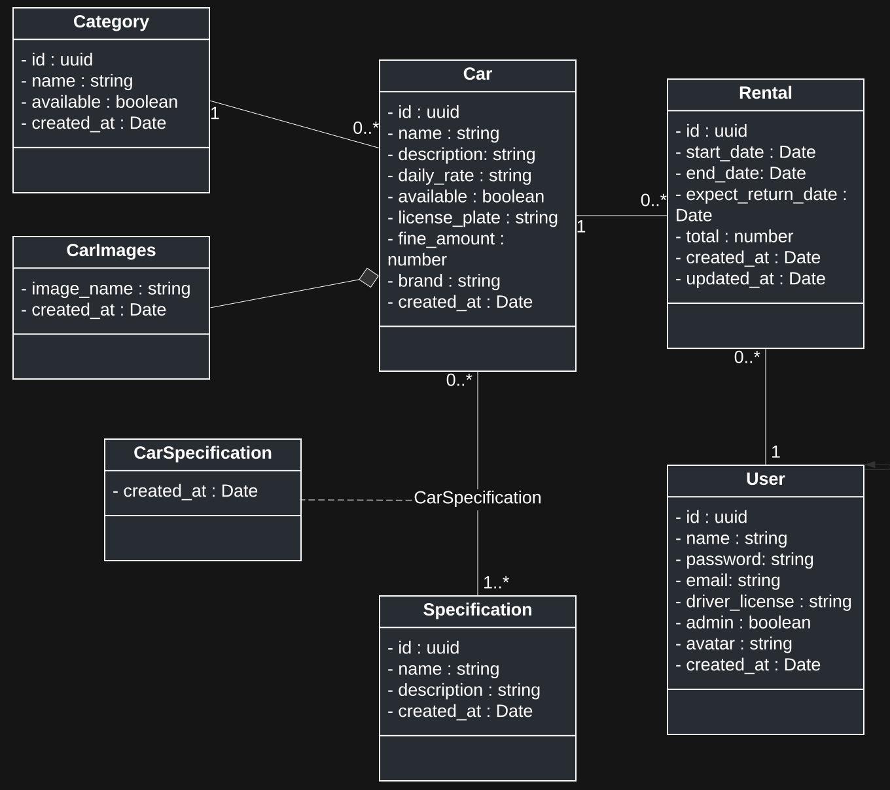
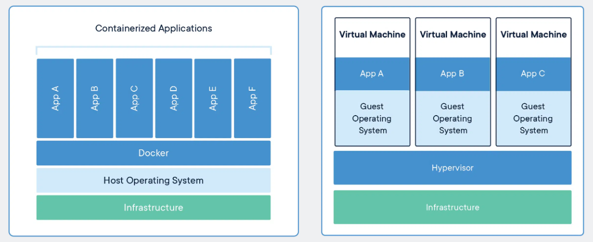

# NodeJS REST API

## UML Class diagram



## PostgreSQL with TypeORM

This project uses TypeORM, an Object Relational Mapper that maps model classes to tables in the database so that queries and mutations in the database use an object-oriented paradigm. It is more flexible because it's decoupled from the DBMS currently being used.

There are other ways to use a database, such as:

- Database Drivers: node-postgres, MongoDB Node Driver.
- Query Builders: Knex.js.
- Some ORM examples: Sequelize, Prisma (Prisma is a next-generation ORM since it uses Prisma schema language (PSL) rather than using classes and decorators for model definition).

### Migrations

TypeORM also helps to create migrations. Migrations are files with SQL queries to update the database schema and apply new changes to an existing database. It allows the development team to use migrations as database schema's version control.

## Docker

A Docker container image is a package of software that includes everything needed to run an application (code and dependencies). When an image is run, it becomes a container. A container runs isolated from its environment. Therefore, even in development, it is an external service.

Containers are portable anywhere, run on the same machine, and share the machine’s OS system kernel (no need to set up a virtual machine for each service. Actually, each container runs as an isolated process).

The image below, from [Docker website, "What is a Container?"](https://www.docker.com/resources/what-container/), shows an infrastructure comparison between containers and virtual machines:



In the Virtual Machines scenario, it states that: "Virtual machines (VMs) are an abstraction of physical hardware turning one server into many servers. The hypervisor allows multiple VMs to run on a single machine. Each VM includes a full copy of an operating system, the application, necessary binaries and libraries – taking up tens of GBs. VMs can also be slow to boot."

### Dockerfile

With Docker, we can define instructions to build a docker container image through a `Dockerfile`; building and running an image:

```shell
$ docker build -t image-name .
```

```shell
$ docker run -p 3333:3333 image-name

# -p 3333:3333 creates a mapping between the host’s port 3333 to the container’s port 3333
```

Additional commands:

```shell
$ docker ps

# Lists containers running
```

```shell
$ docker ps -a

# Lists all containers (up and down)
```

```shell
$ docker rm container-id
```

```shell
$ docker start container-id

# Starts a created container
```

```shell
$ docker logs container-name
```

```shell
$ docker exec -it container-name bash

# Access container terminal (similar to accessing a machine through ssh)
```

Using `docker exec` command we can execute commands in the Linux machine:

```shell
$ docker exec container-name cat 0< /etc/hosts

# Get container IP, redirecting stdin of cat linux utility to /etc/hosts

$ docker exec container-name hostname -i

# Get container IP, through hostname command
```

The execution of migrations with TypeORM is made using `docker exec` since the localhost is not connected to Postgres, but the app container is connected to the postgresql-database container.

> Overall, both the container's id and name can be used interchangeably in these commands.

We can also use docker-compose to document and configure all of the application’s service dependencies (databases, message brokers, service APIs, etc).

```shell
$ docker-compose up -d

# Starts a container for each dependency configured, -d flag (detached mode).
```

Additional commands

```shell
$ docker-compose stop

# Stops services running
```

```shell
$ docker-compose down

# Stops services running and removes the containers (passing --volumes flag also removes the data volume)
```

## Authentication

The authentication is done through JSON Web Tokens and Refresh Tokens. This approach allows the token to have a short expiration time. Once it is necessary to generate a JWT, the client sends the refresh token to the server to get a valid one together with a new refresh token which will be in hand to update the token later. It brings greater security, first that if a malicious user gets the token it will have a short duration. Second, the backend is also signing the refresh token for integrity checking. The compromised refresh token can also be revoked or denied from the database. This approach also improves user experience, since the refresh token can be acquired by sending an HTTP request by the app running on the client-side, instead of having to prompt the user to authenticate again after a specific time. The downside is the refresh token must be maintained in the database (invalidating already used refresh tokens appropriately).

## Deploy

## Running the application

```shell
# Run the containers
$ docker-compose up -d
```

```shell
# Execute the migrations in the running container
$ docker exec nodejs-rest-api npm run typeorm migration:run -- -d "./src/shared/infra/typeorm/index.ts"
```

```shell
# Run unit and integration tests
$ npm run test
```

## Requirements engineering

### Functional requirements

| Id   | Name                            | Actor         |
| ---- | ------------------------------- | ------------- |
| RF01 | Register car                    | Administrator |
| RF02 | List all available cars         | User          |
| RF03 | List available cars by category | User          |
| RF04 | List available cars by brand    | User          |
| RF05 | List available cars by name     | User          |
| RF06 | Register car's category         | Administrator |
| RF06 | Register car's specification    | Administrator |
| RF07 | List all specifications         | Administrator |
| RF08 | List all categories             | User          |
| RF09 | Register car's images           | Administrator |
| RF10 | List all cars                   | Administrator |
| RF11 | Register car rental             | User          |
| RF12 | Register the car's return       | User          |
| RF13 | List rentals                    | User          |
| RF14 | Recover password                | User          |

### Non-functional requirements

| Id    | Description                                           |
| ----- | ----------------------------------------------------- |
| RNF01 | Use node.js multer library to upload files.           |
| RNF02 | The cloud provider must be Amazon Web Services (AWS). |

### Business rules

| Id   | Description                                                                   | Functional Requirement |
| ---- | ----------------------------------------------------------------------------- | ---------------------- |
| RN01 | It shouldn't register a car with a license plate already existing.            | RF01                   |
| RN02 | The users should be able to list cars even when not logged in.                | RF02, RF03, RF04, RF05 |
| RN03 | It shouldn't register a specification for an unregistered car.                | RF06                   |
| RN04 | It shouldn't register a specification already existing for the same car.      | RF06                   |
| RN05 | It should register more than one image for the same car.                      | RF09                   |
| RN06 | It should register a rental with a twenty-four-hour minimum duration.         | RF11                   |
| RN07 | It shouldn't register a rental if there is an unclosed rent for the user.     | RF11                   |
| RN08 | It shouldn't register a rental for an unavailable car.                        | RF11                   |
| RN09 | It should charge the daily rate if the car is returned in less than 24 hours. | RF12                   |
| RN10 | It should charge a proportional fine if the car's return is late.             | RF12                   |
| RN11 | It should allow access to the password recovery link for 3 hours.             | RF14                   |
| RN12 | It should make a car unavailable once it is registered in a rental            | RF11                   |
| RN13 | It should make the car available for rental once its return is registered     | RF12                   |

## Rocketseat Education

I studied this project during the Node.js Ignite program by Rocketseat. Ignite is an acceleration program focused on specialization paths according to your choice and career moment.
